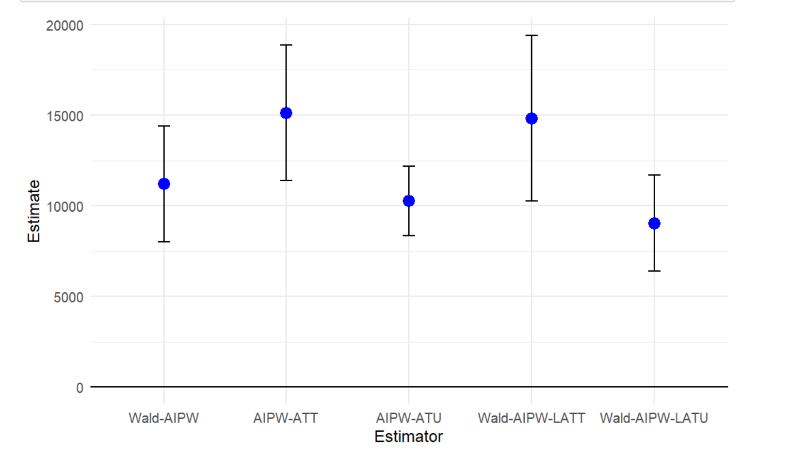
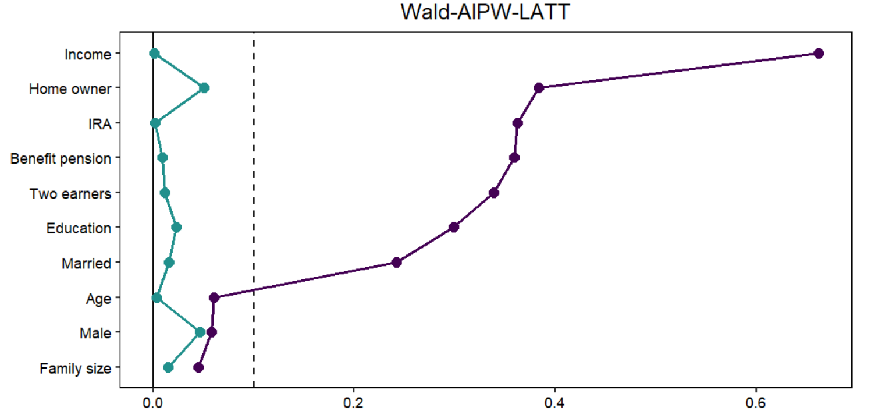
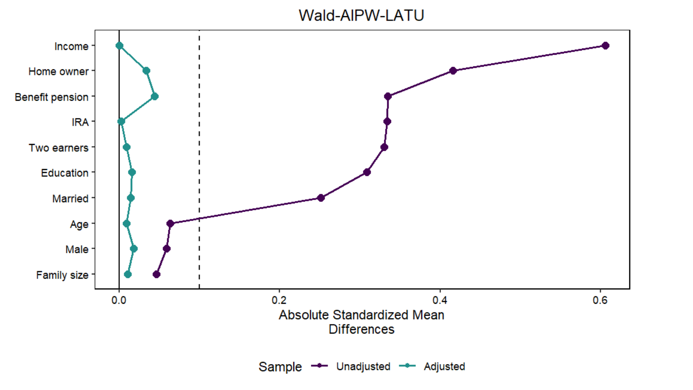

# Local Average Treatment Effects with Outcome Weights

This repository documents a reproducible causal machine learning project on outcome-weight representations for local treatment effects in an instrumental-variable setting. The analysis studies Local Average Treatment Effects on the Treated and Untreated (LATT/LATU), derives Neyman-orthogonal score representations, implements the estimators in a Double Machine Learning workflow, and evaluates them in a 401(k) pension-data application.

This README is the recommended browser-readable entry point for GitHub. The full derivations and code remain in the R Markdown notebook.

## Quick Links

- [Full R Markdown source](analysis.Rmd)
- [Rendered notebook output](analysis.nb.html)
- [Reproducibility helper](requirements.R)

## Motivation

Many empirical economics applications use instrumental variables to identify local treatment effects when treatment take-up is imperfect. This project focuses on two target parameters: the Local Average Treatment effect on the Treated (LATT) and the Local Average Treatment effect on the Untreated (LATU). Building on the outcome-weights perspective, the analysis shows how these estimators can be represented as weighted sums of observed outcomes, which makes it possible to inspect covariate balance and compare target populations across estimators.

## Methods

The project covers:

- Identification of LATT and LATU under standard instrumental-variable assumptions.
- Derivation of Neyman-orthogonal scores for Wald-AIPW-style LATT and LATU estimators.
- Double Machine Learning with cross-fitting and generalized random forest nuisance estimation.
- Use of a local `OutcomeWeights` submodule for the outcome-weight workflow.
- An explicitly attributed extension file in `extensions/` that documents the small project-specific LATT/LATU additions to the DML-with-smoother workflow adapted from `OutcomeWeights`.
- Covariate balance checks using Love plots and absolute standardized mean differences, following the diagnostic workflow used in the `OutcomeWeights` 401(k) application vignette.

## Data

The empirical illustration uses the `pension` dataset loaded after attaching the `hdm` package in `analysis.Rmd`. No raw individual-level data files are stored in the repository. The analysis constructs the treatment, instrument, outcome, and covariate matrix in the notebook from the package-provided dataset.

The empirical setup follows the 401(k) application vignette of Knaus' `OutcomeWeights` package, which uses `hdm::pension` to define the treatment, instrument, outcome, and covariate matrix for illustrating outcome weights in an instrumental-variable setting.

The `Paper/` folder is intentionally ignored because it contains local reference copies that should not be committed. No external task sheet or presentation PDF is required to run the analysis.

## Repository Structure

```text
.
|-- README.md                               # GitHub-facing project overview
|-- analysis.Rmd                            # Full R Markdown source
|-- analysis.nb.html                        # Rendered notebook output
|-- requirements.R                          # Minimal dependency helper
|-- OutcomeWeights/                         # Local OutcomeWeights submodule used by the analysis
|-- extensions/
|   `-- outcomeweights_dml_smoother_extension.R # Attributed DML smoother adaptation
`-- Figures/                                # Selected exported figures
```

## Reproducibility

The project is written in R and R Markdown. The main notebook installs and loads the local `OutcomeWeights` submodule used by the rendered analysis. The file `extensions/outcomeweights_dml_smoother_extension.R` records the small project-specific LATT/LATU additions to the DML-with-smoother workflow and is included with explicit attribution to the original `OutcomeWeights` implementation.

Clone or initialize the repository with submodules:

```bash
git clone --recurse-submodules <repository-url>
```

If you have already cloned the repository:

```bash
git submodule update --init --recursive
```

Install the required R packages and the local `OutcomeWeights` package:

```bash
Rscript requirements.R
```

On Windows, installing the local package may require Rtools because `OutcomeWeights` includes compiled code through Rcpp.

## Running the Analysis

Render the notebook from the repository root:

```bash
Rscript -e "rmarkdown::render('analysis.Rmd')"
```

The rendered analysis is available as `analysis.nb.html`. The main empirical section uses a fixed seed and 5-fold cross-fitting for reproducibility.

## Key Outputs

The current rendered notebook reports point estimates for Wald-AIPW, AIPW-ATT, AIPW-ATU, Wald-AIPW-LATT, and Wald-AIPW-LATU on the 401(k) application. In the rendered output, the LATT and LATU extensions replicate the corresponding outcome-weighted point estimates and are accompanied by covariate balance diagnostics. The reported estimates should be interpreted as methodological illustration, not as standalone empirical claims.

Current rendered estimates:

| Estimator | Estimate | Standard error |
| --- | ---: | ---: |
| Wald-AIPW | 11,217.0 | 1,630.0 |
| AIPW-ATT | 15,128.2 | 1,912.7 |
| AIPW-ATU | 10,272.5 | 976.4 |
| Wald-AIPW-LATT | 14,826.2 | 2,326.5 |
| Wald-AIPW-LATU | 9,046.5 | 1,349.1 |

Point estimates and confidence intervals for the estimators reported in the rendered notebook:



Covariate balance diagnostic for the Wald-AIPW-LATT outcome weights:



Covariate balance diagnostic for the Wald-AIPW-LATU outcome weights:



## Technical Stack

- R and R Markdown
- `OutcomeWeights` local submodule
- Attributed DML-with-smoother extension in `extensions/`
- `grf` for generalized random forest nuisance estimation
- `hdm` for the pension application dataset
- `cobalt` for balance diagnostics
- `tidyverse`, `viridis`, and `gridExtra` for data handling and visualization
- `devtools`, `rmarkdown`, and `knitr` for local package installation and rendering

## Attribution

This project builds on Michael C. Knaus' [`OutcomeWeights`](https://github.com/MCKnaus/OutcomeWeights) package and its [`OutcomeWeights` 401(k) application vignette](https://mcknaus.github.io/OutcomeWeights/articles/Application_average_401k.html). In particular, the empirical application structure, use of the `hdm::pension` dataset, outcome-weight extraction workflow, and covariate-balance diagnostics are based on the package vignette. The project contribution was to derive and integrate additional LATT/LATU estimators and document the resulting workflow for reproducible review.

## Team and Contributions

This project was developed by Egor Trushkov and Dominic Pöltl. Dominic Pöltl contributed to the derivation of the LATT/LATU score representations, their implementation in the DML workflow, the empirical analysis, and the preparation of the public reproducibility documentation.

## Scope and Disclaimer

This repository originated in a causal machine learning course. It is intended as a reproducible academic project and portfolio artifact, not as a polished software package or standalone peer-reviewed research paper. The empirical results should be read as methodological illustration and evidence of implementation, derivation, and reproducibility practice rather than as independent policy claims.
